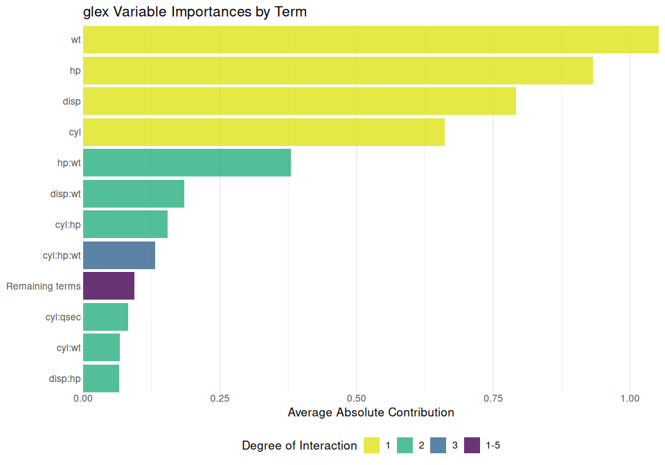
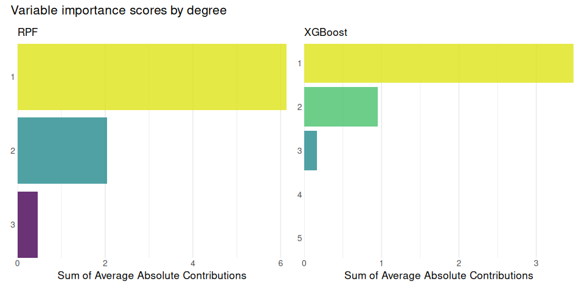
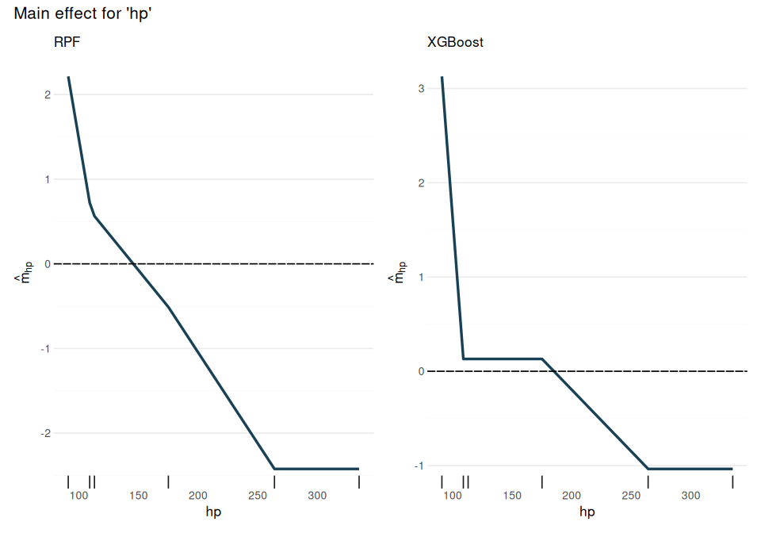
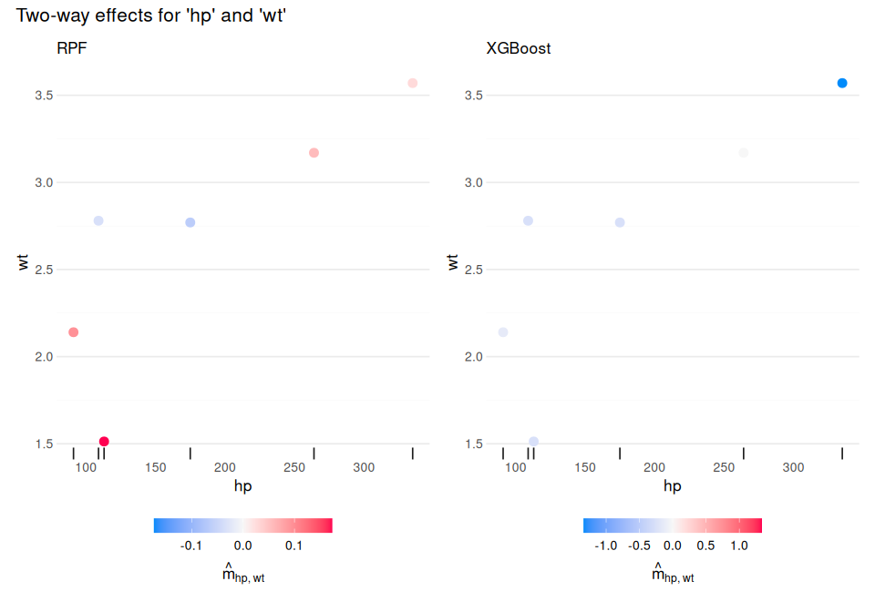
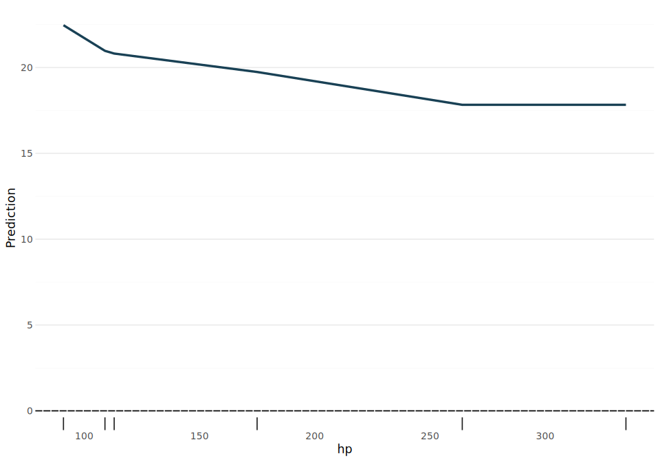
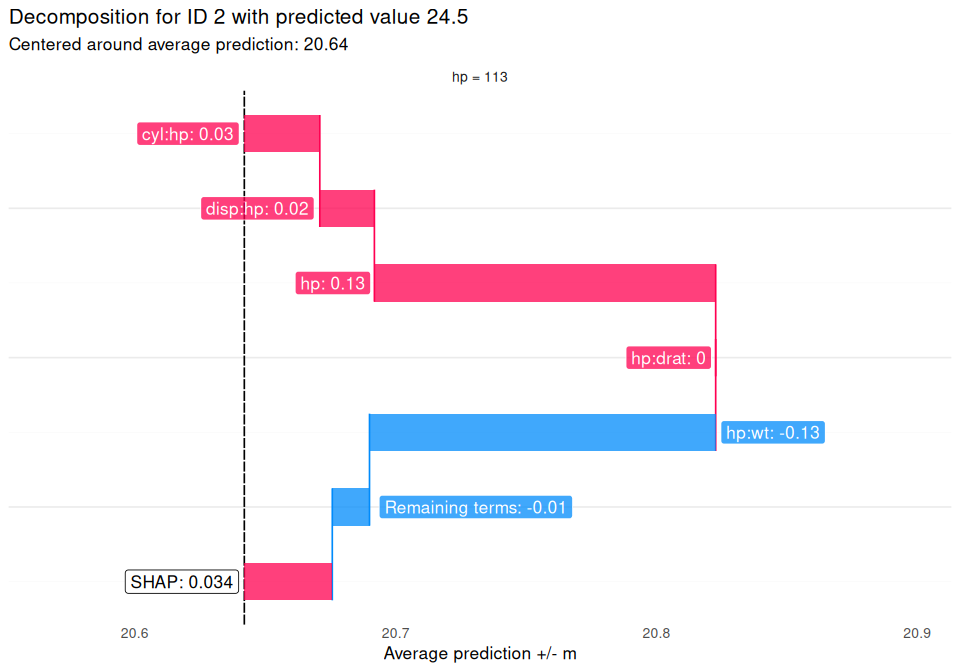

<!-- README.md is generated from README.Rmd. Please edit that file -->

# Global explanations for tree-based models

<!-- badges: start -->

[](https://github.com/PlantedML/glex/actions/workflows/R-CMD-check.yaml)
[](https://plantedml.r-universe.dev/glex)
[](https://CRAN.R-project.org/package=glex)
<!-- badges: end -->

# Overview

`glex` implements **global, functional decompositions** of tree-based
regression and classification models that decomposes them into **main
effects** and **interaction effects** of arbitrary order. In particular,
it can

- compute **exact interventional SHAP values** (and more generally,
  *q-interaction interventional SHAP*, where *q* is the maximal
  interaction order present in the model),
- extract **partial-dependence-functions** (e.g., one dimensional
  partial dependence plots),
- produce **variable‐importance scores** for each main term and
  interaction term (of any order), and
- supports **de-biasing** by removing components that include protected
  features.

Under the hood, `glex` relies on fast algorithms to compute all required
partial dependence functions exactly.

For a detailed description of the methodology, see:

See the accompanying paper for more details and exact definitions:
“Unifying local and global model explanations by functional
decomposition of low dimensional structures”
([arxiv](https://arxiv.org/abs/2208.06151),
[PMLR](https://proceedings.mlr.press/v206/hiabu23a.html)).

> **Hiabu, Meyer & Wright (2023).**\
> *Unifying local and global model explanations by functional
> decomposition of low dimensional structures.*\
> [arXiv](https://arxiv.org/abs/2208.06151) • [AISTATS 2023
> Proceedings](https://proceedings.mlr.press/v206/hiabu23a.html)

> **Liu, Steensgaard, Wright, Pfister, Hiabu (2023).**\
> *Fast Estimation of Partial Dependence Functions using Trees.*\
> [arXiv](https://arxiv.org/abs/2410.13448)

## Installation

You can install the development version of glex from
[GitHub](https://github.com/) with:

``` r
# install.packages("pak")
pak::pak("PlantedML/glex")
```

or from [r-universe](https://plantedml.r-universe.dev/packages) with

``` r
install.packages("glex", repos = "https://plantedml.r-universe.dev")
```

# Supported Models

`glex` currently provides methods for the model classes below.

| Model package | Model class | Regression | Binary classification | Multiclass classification | Link function(s) | Notes |
|----|----|----|----|----|----|----|
| `xgboost` | `xgb.Booster` | Yes | Yes\* | Not yet fully supported | Built-in objectives define the link (e.g., identity, logistic/logit, log-link). | \* `glex()` decomposes predictions on the raw margin scale; apply the inverse link to recover response-scale predictions. |
| `randomPlantedForest` | `rpf` | Yes | Yes | Yes | Not applicable | Native support for multiclass terms in plotting and variable importance workflows. |
| `ranger` | `ranger` | Yes | Yes\* (probability forests) | Not yet supported | Not applicable | \* Requires `node.stats = TRUE`. For classification, fit with `probability = TRUE`; ranger predicts class probabilities directly from class frequencies in terminal nodes (no inverse link needed). Multiclass is currently unsupported. |

More tree-based frameworks may be added in future releases. If you have
a suggestion, please open an issue on our GitHub repository.

### XGBoost with Link Functions

For generalized objectives, XGBoost outputs an additive raw-score
(margin) function:

$$
\eta(x) = b + \sum_{t=1}^{T} f_t(x), \qquad \mu(x)=g^{-1}(\eta(x)).
$$

Here, $b$ is the global bias term (`base_score` on the margin scale),
and each $f_t$ is the prediction function of tree $t$ (its leaf weight
for input $x$). In other words, the XGBoost model output is $\eta(x)$
itself; response-scale prediction is obtained by applying the
objective-specific inverse link $g^{-1}$ to that output.\
`glex()` decomposes $\eta(x)$, not $\mu(x)$. The decomposition is

$$
\eta(x) = m_{\emptyset} + \sum_{S \neq \emptyset} m_S(x_S) = m_{\emptyset} + \sum_{k=1}^{p} \phi_k(x),
$$

where $m_{\emptyset}$ is the intercept term, $m_S$ are the functional
ANOVA components indexed by feature subsets $S$, and $\phi_k$ are SHAP
values aggregated per feature $k$. This margin equals
`predict(model, x, outputmargin = TRUE)`.\
Predictions on response scale are obtained by applying the inverse link:

$$
\mu(x)=g^{-1}(\eta(x))=g^{-1}\left(m_{\emptyset} + \sum_{S \neq \emptyset} m_S(x_S)\right).
$$

This yields the objective-specific identities:

$$
\text{identity link:}\quad \mu(x)=\eta(x)
$$

$$
\text{logistic link (binary:logistic):}\quad \mu(x)=\sigma(\eta(x))=\frac{1}{1+e^{-\eta(x)}}
$$

$$
\text{log link (count:poisson, reg:gamma, reg:tweedie):}\quad \mu(x)=\exp(\eta(x))
$$

For custom objectives, XGBoost does not provide a built-in response
transform. In that case, run `glex()` as usual to decompose the raw
margin, then apply your own inverse link **afterwards** to the
reconstructed margin, e.g. to `gl$intercept + rowSums(gl$m)` (or
equivalently `gl$intercept + rowSums(gl$shap)`), to obtain
response-scale predictions.

``` r
x <- as.matrix(mtcars[, -1])
y_bin <- as.numeric(mtcars$mpg > median(mtcars$mpg))

xg_bin <- xgboost::xgb.train(
  params = list(objective = "binary:logistic", max_depth = 3, eta = .1),
  data = xgboost::xgb.DMatrix(data = x[1:26, ], label = y_bin[1:26]),
  nrounds = 30,
  verbose = 0
)

glex_xgb_bin <- glex::glex(xg_bin, x[27:32, ])

# Additive decomposition returned by glex (margin / log-odds scale)
margin_glex <- glex_xgb_bin$intercept + rowSums(glex_xgb_bin$shap)

# XGBoost predictions on test data
pred_prob <- predict(xg_bin, x[27:32, ])
pred_margin <- predict(xg_bin, x[27:32, ], outputmargin = TRUE)

# Apply the inverse link for binary:logistic
prob_from_glex <- plogis(margin_glex)

cbind(pred_prob, prob_from_glex, pred_margin, margin_glex)
#>                 pred_prob prob_from_glex pred_margin margin_glex
#> Porsche 914-2  0.90160328     0.90160331    2.215168    2.215167
#> Lotus Europa   0.90160328     0.90160331    2.215168    2.215167
#> Ford Pantera L 0.90160328     0.90160331    2.215168    2.215167
#> Ferrari Dino   0.90160328     0.90160331    2.215168    2.215167
#> Maserati Bora  0.07015713     0.07015714   -2.584278   -2.584278
#> Volvo 142E     0.90160328     0.90160331    2.215168    2.215167

max(abs(pred_margin - margin_glex))
#> [1] 1.323593e-07
max(abs(pred_prob - prob_from_glex))
#> [1] 3.020367e-08
```

Binary logistic example (`objective = "binary:logistic"`):

In this case $\eta(x)$ is log-odds and the inverse link is the logistic
map:

$$
F(x) = b + \sum_{t=1}^{T} f_t(x), \qquad p(x) = \sigma(F(x)) = \frac{1}{1 + e^{-F(x)}}.
$$

XGBoost optimizes logistic loss directly in this margin:

$$
\ell(y, F) = -\left[y \log \sigma(F) + (1-y)\log(1-\sigma(F))\right].
$$

`glex()` decomposes the margin additively into interaction components
indexed by feature subsets $S$:

$$
F(x) = m_{\emptyset} + \sum_{S \neq \emptyset} m_S(x_S),
$$

where `intercept` is $m_{\emptyset}$ and `m` stores $m_S$. Hence:

$$
\texttt{intercept + rowSums(m)} \equiv \texttt{predict(..., outputmargin = TRUE)}.
$$

For SHAP values, `glex` distributes each interaction term equally across
features in that term:

$$
\phi_j(x) = \sum_{S \ni j} \frac{m_S(x_S)}{|S|},
\qquad
F(x) = m_{\emptyset} + \sum_{j=1}^{p}\phi_j(x).
$$

Hence:

$$
\texttt{plogis(intercept + rowSums(shap))} \equiv \texttt{predict(...)}.
$$

Interpretation on this scale is direct: positive components increase
log-odds (and therefore probability), negative components decrease
log-odds, and an increase of $+1$ in margin multiplies the odds by $e$.

## What’s Included

The examples below use
[`xgboost`](https://cran.r-project.org/package=xgboost) and
[`randomPlantedForest`](http://plantedml.com/randomPlantedForest/)
models:

``` r
# Install xgboost from CRAN
install.packages("xgboost")
# ... and randomPlantedForest from r-universe
install.packages("randomPlantedForest", repos = "https://plantedml.r-universe.dev")
```

``` r
library(glex)

# Model fitting
library(randomPlantedForest)
library(xgboost)

# Visualization
library(ggplot2)
library(patchwork)

theme_set(theme_glex())
set.seed(21)
```

Note that `xgboost`, unlike `randomPlantedForest`, requires `matrix`
input and does not support categorical predictors.

``` r
rp <- rpf(mpg ~ ., data = mtcars[1:26, ], max_interaction = 3)

x <- as.matrix(mtcars[, -1])
y <- mtcars$mpg
xg <- xgboost(data = x[1:26, ], label = y[1:26],
              params = list(max_depth = 3, eta = .1),
              nrounds = 30, verbose = 0)
```

Using the model objects and a dataset to explain (such as a test set in
this case), we can create `glex` objects for each of the model fits.
These objects of class `glex` are a list containing the prediction
components of main and interaction terms (`$m`), the dataset to be
explained with the observed feature values (`$x`) used to visualize
feature effects, and the average predicted value for the model
(`$intercept`). The `xgboost` method additionally returns the SHAP
values (`$shap`) for each feature in the model.

``` r
glex_rpf <- glex(rp, mtcars[27:32, ])
glex_xgb <- glex(xg, x[27:32, ])
```

Both `m` and `shap` satisfy the property that their sums (per
observation) together with the `intercept` are equal to the model
prediction for each observation:

``` r
# Calculating sum of components and sum of SHAP values
sum_m_rpf <- rowSums(glex_rpf$m) + glex_rpf$intercept
sum_m_xgb <- rowSums(glex_xgb$m) + glex_xgb$intercept
sum_shap_xgb <- rowSums(glex_xgb$shap) + glex_xgb$intercept

# Model predictions
pred_rpf <- predict(rp, mtcars[27:32, ])[[1]]
pred_xgb <- predict(xg, x[27:32, ])

# For XGBoost
cbind(pred_xgb, sum_m_xgb, sum_shap_xgb)
#>                pred_xgb sum_m_xgb sum_shap_xgb
#> Porsche 914-2  23.84291  23.84291     23.84291
#> Lotus Europa   25.30800  25.30801     25.30801
#> Ford Pantera L 20.71024  20.71024     20.71024
#> Ferrari Dino   20.99034  20.99034     20.99034
#> Maserati Bora  14.89887  14.89887     14.89887
#> Volvo 142E     21.55361  21.55361     21.55361

# For RPF
cbind(pred_rpf, sum_m_rpf)
#>      pred_rpf sum_m_rpf
#> [1,] 29.34468  29.34468
#> [2,] 28.28776  28.28776
#> [3,] 18.10135  18.10135
#> [4,] 20.31319  20.31319
#> [5,] 14.80156  14.80156
#> [6,] 23.96188  23.96188
```

### Variable Importances

Variable importance scores are calculated for each main and interaction
term by calculating the average of the absolute prediction components
(`m`) over the dataset supplied to `glex()`.

``` r
vi_rpf <- glex_vi(glex_rpf)
vi_xgb <- glex_vi(glex_xgb)

vi_rpf[1:5, c("degree", "term", "m")]
#>    degree   term         m
#>     <int> <char>     <num>
#> 1:      1     wt 1.4893211
#> 2:      1   disp 1.2539334
#> 3:      1     hp 1.1017759
#> 4:      1    cyl 0.7172987
#> 5:      1   drat 0.5465836
vi_xgb[1:5, c("degree", "term", "m")]
#>    degree      term         m
#>     <int>    <char>     <num>
#> 1:      1        wt 1.4145524
#> 2:      1      disp 1.0614659
#> 3:      1        hp 0.6307429
#> 4:      2     hp:wt 0.5823452
#> 5:      3 cyl:hp:wt 0.3538588
```

The output additionally contains the degree of interaction, which can be
used for filtering and aggregating. Here we filter for terms with
contributions above a `threshold` of `0.05` to get a more compact plot,
with terms below the threshold aggregated into one labelled “Remaining
terms”:

``` r
p_vi1 <- autoplot(vi_rpf, threshold = .05) + 
  labs(title = NULL, subtitle = "RPF")

p_vi2 <- autoplot(vi_xgb, threshold = .05) + 
  labs(title = NULL, subtitle = "XGBoost")

p_vi1 + p_vi2 +
  plot_annotation(title = "Variable importance scores by term")
```



We can also sum values within each degree of interaction for a more
aggregated view, which can be useful as it allows us to judge
interactions above a certain degree to not be particularly relevant for
a given model.

``` r
p_vi1 <- autoplot(vi_rpf, by_degree = TRUE) + 
  labs(title = NULL, subtitle = "RPF")

p_vi2 <- autoplot(vi_xgb, by_degree = TRUE) + 
  labs(title = NULL, subtitle = "XGBoost")

p_vi1 + p_vi2 +
  plot_annotation(title = "Variable importance scores by degree") 
```



### Feature Effects

We can also plot prediction components against observed feature values,
which admittedly produces more interesting output with larger, more
interesting datasets.

``` r
p1 <- autoplot(glex_rpf, "hp") + labs(subtitle = "RPF")
p2 <- autoplot(glex_xgb, "hp") + labs(subtitle = "XGBoost")

p1 + p2 + 
  plot_annotation(title = "Main effect for 'hp'")
```



``` r

p1 <- autoplot(glex_rpf, c("hp", "wt")) + labs(subtitle = "RPF")
p2 <- autoplot(glex_xgb, c("hp", "wt")) + labs(subtitle = "XGBoost")

p1 + p2 + 
  plot_annotation(title = "Two-way effects for 'hp' and 'wt'")
```



Currently there is support for plots of interactions up to the third
degree, including continuous and categorical features. Unfortunately,
three-way interactions of continuous features are not supported yet.

Note that these main effect plots correspond to PDP plots, where the
latter are merely the main effect plus the intercept term:

``` r
plot_pdp(glex_rpf, "hp")
```



### Decomposition of Individual Predictions

Finally, we can explore the prediction for a single observation by
displaying its individual prediction components. The SHAP value is the
sum of all of these components and serves as a reference value. For
compactness, we only plot one feature and collapse all interaction terms
above the second degree into one as their combined effect is very small.

``` r
p1 <- glex_explain(glex_rpf, id = 2, predictors = "hp", max_interaction = 2) + 
  labs(tag = "RPF")
p2 <- glex_explain(glex_xgb, id = 2, predictors = "hp", max_interaction = 2) + 
  labs(tag = "XGBoost")

p1 + p2 & theme(plot.tag.position = "bottom")
```


