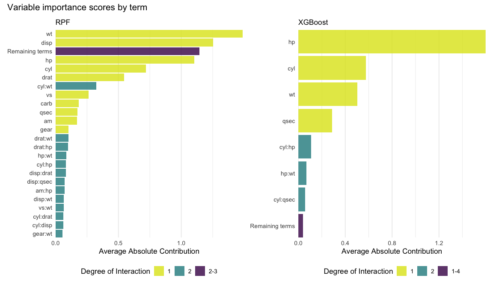
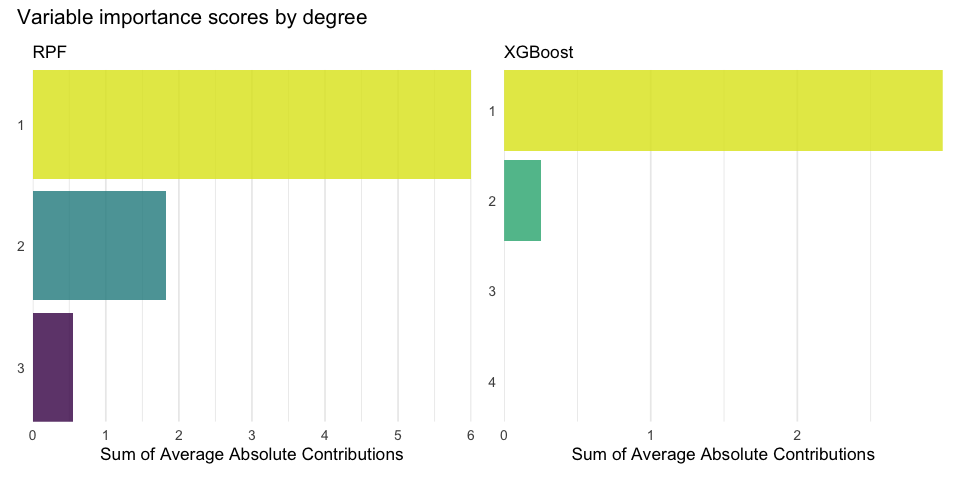
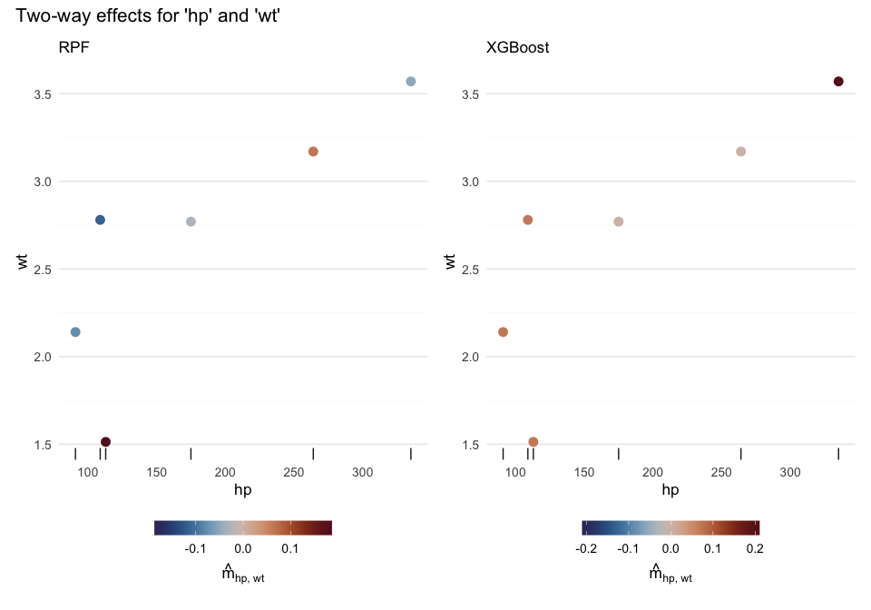
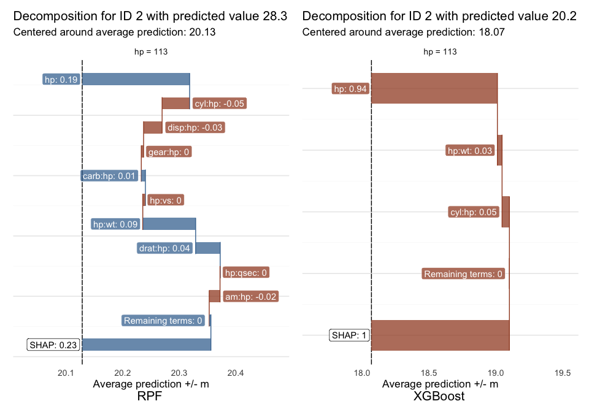

<!-- README.md is generated from README.Rmd. Please edit that file -->

# Global explanations for tree-based models

<!-- badges: start -->

[](https://github.com/PlantedML/glex/actions/workflows/R-CMD-check.yaml)
[](https://plantedml.r-universe.dev/glex)
[](https://CRAN.R-project.org/package=glex)
<!-- badges: end -->

# Overview

`glex` implements **global, functional decompositions** of tree-based
regression and classification models that decomposes them into **main
effects** and **interaction effects** of arbitrary order. In particular,
it can

- compute **exact interventional SHAP values** (and more generally,
  *q-interaction interventional SHAP*, where *q* is the maximal
  interaction order present in the model),
- extract **partial-dependence-functions** (e.g., one dimensional
  partial dependence plots),
- produce **variable‐importance scores** for each main term and
  interaction term (of any order), and

Under the hood, `glex` relies on fast algorithms to compute all required
partial dependence functions exactly.

For a detailed description of the methodology, see:

“Unifying local and global model explanations by functional
decomposition of low dimensional structures”
([arxiv](https://arxiv.org/abs/2208.06151),
[PMLR](https://proceedings.mlr.press/v206/hiabu23a.html)).

> **Hiabu, Meyer & Wright (2023).**  
> *Unifying local and global model explanations by functional
> decomposition of low dimensional structures.*  
> [arXiv](https://arxiv.org/abs/2208.06151) • [AISTATS 2023
> Proceedings](https://proceedings.mlr.press/v206/hiabu23a.html)

> **Liu, Steensgaard, Wright, Pfister, Hiabu (2025).**  
> *Fast Estimation of Partial Dependence Functions using Trees.*  
> [arXiv](https://arxiv.org/abs/2410.13448)

## Installation

You can install the development version of glex from
[GitHub](https://github.com/) with:

``` r
# install.packages("pak")
pak::pak("PlantedML/glex")
```

or from [r-universe](https://plantedml.r-universe.dev/packages) with

``` r
install.packages("glex", repos = "https://plantedml.r-universe.dev")
```

# Supported Models

Currently, `glex` supports:

- **XGBoost** (via the `xgboost` package).

- **Random Planted Forest** (via the `randomPlantedForest` package).

More tree‐based frameworks may be added in future releases. If you have
a suggestion, please open an issue on our GitHub repository.

## What’s Included

Currently `glex` works with
[`xgboost`](https://cran.r-project.org/package=xgboost) and
[`randomPlantedForest`](http://plantedml.com/randomPlantedForest/)
models, so we’ll start by fitting a model with one of each:

``` r
# Install xgboost from CRAN
install.packages("xgboost")
# ... and randomPlantedForest from r-universe
install.packages("randomPlantedForest", repos = "https://plantedml.r-universe.dev")
```

``` r
library(glex)

# Model fitting
library(randomPlantedForest)
library(xgboost)

# Visualization
library(ggplot2)
library(patchwork)

theme_set(theme_glex())
set.seed(21)
```

Note that `xgboost`, unlike `randomPlantedForest`, requires `matrix`
input and does not support categorical predictors.

``` r
rp <- rpf(mpg ~ ., data = mtcars[1:26, ], max_interaction = 3)

x <- as.matrix(mtcars[, -1])
y <- mtcars$mpg
xg <- xgboost(data = x[1:26, ], label = y[1:26],
              params = list(max_depth = 3, eta = .1),
              nrounds = 30, verbose = 0)
```

Using the model objects and a dataset to explain (such as a test set in
this case), we can create `glex` objects for each of the model fits.
These objects of class `glex` are a list containing the prediction
components of main and interaction terms (`$m`), the dataset to be
explained with the observed feature values (`$x`) used to visualize
feature effects, and the average predicted value for the model
(`$intercept`). The `xgboost` method additionally returns the SHAP
values (`$shap`) for each feature in the model.

``` r
glex_rpf <- glex(rp, mtcars[27:32, ])
glex_xgb <- glex(xg, x[27:32, ])
```

Both `m` and `shap` satisfy the property that their sums (per
observation) together with the `intercept` are equal to the model
prediction for each observation:

``` r
# Calculating sum of components and sum of SHAP values
sum_m_rpf <- rowSums(glex_rpf$m) + glex_rpf$intercept
sum_m_xgb <- rowSums(glex_xgb$m) + glex_xgb$intercept
sum_shap_xgb <- rowSums(glex_xgb$shap) + glex_xgb$intercept

# Model predictions
pred_rpf <- predict(rp, mtcars[27:32, ])[[1]]
pred_xgb <- predict(xg, x[27:32, ])

# For XGBoost
cbind(pred_xgb, sum_m_xgb, sum_shap_xgb)
#>      pred_xgb sum_m_xgb sum_shap_xgb
#> [1,] 21.39075  21.39076     21.39076
#> [2,] 20.23664  20.23664     20.23664
#> [3,] 14.73895  14.73895     14.73895
#> [4,] 18.76170  18.76170     18.76170
#> [5,] 13.05614  13.05614     13.05614
#> [6,] 20.23664  20.23664     20.23664

# For RPF
cbind(pred_rpf, sum_m_rpf)
#>      pred_rpf sum_m_rpf
#> [1,] 29.34468  29.34468
#> [2,] 28.28776  28.28776
#> [3,] 18.10135  18.10135
#> [4,] 20.31319  20.31319
#> [5,] 14.80156  14.80156
#> [6,] 23.96188  23.96188
```

### Variable Importances

Variable importance scores are calculated for each main and interaction
term by calculating the average of the absolute prediction components
(`m`) over the dataset supplied to `glex()`.

``` r
vi_rpf <- glex_vi(glex_rpf)
vi_xgb <- glex_vi(glex_xgb)

vi_rpf[1:5, c("degree", "term", "m")]
#>    degree   term         m
#>     <int> <char>     <num>
#> 1:      1     wt 1.4893211
#> 2:      1   disp 1.2539334
#> 3:      1     hp 1.1017759
#> 4:      1    cyl 0.7172987
#> 5:      1   drat 0.5465836
vi_xgb[1:5, c("degree", "term", "m")]
#>    degree   term         m
#>     <int> <char>     <num>
#> 1:      1     hp 1.5980083
#> 2:      1    cyl 0.5762864
#> 3:      1     wt 0.5024355
#> 4:      1   qsec 0.2867502
#> 5:      2 cyl:hp 0.1098818
```

The output additionally contains the degree of interaction, which can be
used for filtering and aggregating. Here we filter for terms with
contributions above a `threshold` of `0.05` to get a more compact plot,
with terms below the threshold aggregated into one labelled “Remaining
terms”:

``` r
p_vi1 <- autoplot(vi_rpf, threshold = .05) + 
  labs(title = NULL, subtitle = "RPF")

p_vi2 <- autoplot(vi_xgb, threshold = .05) + 
  labs(title = NULL, subtitle = "XGBoost")

p_vi1 + p_vi2 +
  plot_annotation(title = "Variable importance scores by term")
```



We can also sum values within each degree of interaction for a more
aggregated view, which can be useful as it allows us to judge
interactions above a certain degree to not be particularly relevant for
a given model.

``` r
p_vi1 <- autoplot(vi_rpf, by_degree = TRUE) + 
  labs(title = NULL, subtitle = "RPF")

p_vi2 <- autoplot(vi_xgb, by_degree = TRUE) + 
  labs(title = NULL, subtitle = "XGBoost")

p_vi1 + p_vi2 +
  plot_annotation(title = "Variable importance scores by degree") 
```



### Feature Effects

We can also plot prediction components against observed feature values,
which admittedly produces more interesting output with larger, more
interesting datasets.

``` r
p1 <- autoplot(glex_rpf, "hp") + labs(subtitle = "RPF")
p2 <- autoplot(glex_xgb, "hp") + labs(subtitle = "XGBoost")

p1 + p2 + 
  plot_annotation(title = "Main effect for 'hp'")
```


``` r

p1 <- autoplot(glex_rpf, c("hp", "wt")) + labs(subtitle = "RPF")
p2 <- autoplot(glex_xgb, c("hp", "wt")) + labs(subtitle = "XGBoost")

p1 + p2 + 
  plot_annotation(title = "Two-way effects for 'hp' and 'wt'")
```



Currently there is support for plots of interactions up to the third
degree, including continuous and categorical features. Unfortunately,
three-way interactions of continuous features are not supported yet.

Note that these main effect plots correspond to PDP plots, where the
latter are merely the main effect plus the intercept term:

``` r
plot_pdp(glex_rpf, "hp")
```


### Decomposition of Individual Predictions

Finally, we can explore the prediction for a single observation by
displaying its individual prediction components. The SHAP value is the
sum of all of these components and serves as a reference value. For
compactness, we only plot one feature and collapse all interaction terms
above the second degree into one as their combined effect is very small.

``` r
p1 <- glex_explain(glex_rpf, id = 2, predictors = "hp", max_interaction = 2) + 
  labs(tag = "RPF")
p2 <- glex_explain(glex_xgb, id = 2, predictors = "hp", max_interaction = 2) + 
  labs(tag = "XGBoost")

p1 + p2 & theme(plot.tag.position = "bottom")
```


