# Bikesharing: Decomposition with Random Planted Forest

``` r
library(glex)
library(randomPlantedForest)
library(data.table)
library(ISLR2) # For Bikeshare dataset
library(ggplot2)
library(patchwork) # To arrange plots
set.seed(2023)
```

## Preparing the Data

First we load the `Bikeshare` data from the `ISLR2` package, which
provides the dataset published at the [UCI Machine Learning
Repository](https://archive.ics.uci.edu/ml/datasets/bike+sharing+dataset).

> This data set contains the hourly and daily count of rental bikes
> between years 2011 and 2012 in Capital bikeshare system, along with
> weather and seasonal information.

The outcome is going to be `bikers`, the total number of bikers in the
system.

The predictors of interest in our case are going to be the following:

- `hr`: Hour of day, 0 to 23 hours.
- `temp`: Normalized temperature in Celsius
- `workingday`: Binary value indicating whether it’s a work day (1) or
  not (0)

We recode the `hr` variable from a 24-level `factor` to a numeric
column.

``` r
data(Bikeshare)
bike <- data.table(Bikeshare)
bike[, hr := as.numeric(as.character(hr))]
bike[, workingday := factor(workingday, levels = c(0, 1), labels = c("No Workingday", "Workingday"))]
bike[, season := factor(season, levels = 1:4, labels = c("Winter", "Spring", "Summer", "Fall"))]

# Only one observation with this condition, removing it to make space.
bike <- bike[weathersit != "heavy rain/snow", ] 

head(bike)
#>    season   mnth   day    hr holiday weekday    workingday   weathersit  temp
#>    <fctr> <fctr> <num> <num>   <num>   <num>        <fctr>       <fctr> <num>
#> 1: Winter    Jan     1     0       0       6 No Workingday        clear  0.24
#> 2: Winter    Jan     1     1       0       6 No Workingday        clear  0.22
#> 3: Winter    Jan     1     2       0       6 No Workingday        clear  0.22
#> 4: Winter    Jan     1     3       0       6 No Workingday        clear  0.24
#> 5: Winter    Jan     1     4       0       6 No Workingday        clear  0.24
#> 6: Winter    Jan     1     5       0       6 No Workingday cloudy/misty  0.24
#>     atemp   hum windspeed casual registered bikers
#>     <num> <num>     <num>  <num>      <num>  <num>
#> 1: 0.2879  0.81    0.0000      3         13     16
#> 2: 0.2727  0.80    0.0000      8         32     40
#> 3: 0.2727  0.80    0.0000      5         27     32
#> 4: 0.2879  0.75    0.0000      3         10     13
#> 5: 0.2879  0.75    0.0000      0          1      1
#> 6: 0.2576  0.75    0.0896      0          1      1
```

## Fitting, Purification, Component Extraction

Next we can fit a Random Planted Forest on the `bikers` variable, using
a subset of the available predictors. We limit the model’s complexity by
setting `max_interaction = 3`, as we are only going to visualize
interactions up to the third degree, and using a higher value here might
only marginally improve predictive performance at the cost of a longer
runtime. For our example here, a smaller model with merely 30 trees
suffices. We also `purify` the forest to enable the desired
decomposition. This step is not required for global predictions and may
take some time, which is why it is implemented as a separate step.

``` r
rp <- rpf(
  bikers ~ day + hr + temp + windspeed + workingday + hum + weathersit + season,
  data = bike,
  max_interaction = 3, ntrees = 50, splits = 100, t_try = 0.9, split_try = 5
)

purify(rp)
#> -- Regression Random Planted Forest --
#> 
#> Formula: bikers ~ day + hr + temp + windspeed + workingday + hum + weathersit +      season 
#> Fit using 8 predictors and 3-degree interactions.
#> Forest is purified!
#> 
#> Called with parameters:
#> 
#>             loss: L2
#>           ntrees: 50
#>  max_interaction: 3
#>           splits: 100
#>        split_try: 5
#>            t_try: 0.9
#>            delta: 0
#>          epsilon: 0.1
#>    deterministic: FALSE
#>         nthreads: 1
#>           purify: FALSE
#>               cv: FALSE
```

We select the predictors of interest and use
[`glex()`](http://plantedml.com/glex/reference/glex.md) to retrieve all
predictive components that include them, from main effects to 3rd degree
interactions. The resulting object also contains the original data as
`x`, which we need for later visualization.

``` r
vars <- c("hr", "temp", "workingday", "hum", "weathersit", "season")

components <- glex(rp, bike, predictors = vars)

# There's a lot of components...
str(components$m, list.len = 8)
#> Classes 'data.table' and 'data.frame':   8644 obs. of  92 variables:
#>  $ day                            : num  -40 -40 -40 -40 -40 ...
#>  $ hr                             : num  -102 -118 -125 -133 -134 ...
#>  $ temp                           : num  -40.2 -40.4 -40.4 -40.2 -40.2 ...
#>  $ windspeed                      : num  1.85 1.85 1.85 1.85 1.85 ...
#>  $ workingday                     : num  0.0162 0.0162 0.0162 0.0162 0.0162 ...
#>  $ hum                            : num  -14.76 -13.84 -13.84 -5.05 -5.05 ...
#>  $ weathersit                     : num  4.29 4.29 4.29 4.29 4.29 ...
#>  $ season                         : num  -24 -24 -24 -24 -24 ...
#>   [list output truncated]
#>  - attr(*, ".internal.selfref")=<externalptr>
```

Please note that fitting the model, purification, and the extraction of
the components may take some time, depending on available resources and
the size of the data. For example, the above steps took around 260
seconds to complete on GitHub Actions.

## Main Effects

``` r
p_main <- plot_main_effect(components, "temp") +
  plot_main_effect(components, "hr") +
  plot_main_effect(components, "workingday")

p_main + plot_layout(widths = c(.3, .3, .4))
```

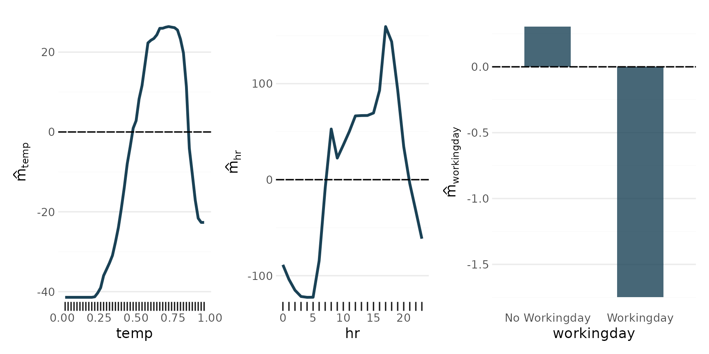

## 2-Way Interactions

``` r
p_2way1 <- plot_twoway_effects(components, c("workingday", "temp"))
p_2way2 <- plot_twoway_effects(components, c("hr", "workingday"))
p_2way3 <- plot_twoway_effects(components, c("hr", "temp"))

p_2way <- (p_2way1 / p_2way2 + 
    plot_layout(guides = "collect") &
      theme(legend.position = "bottom")) | p_2way3

p_2way <- p_2way + 
  plot_annotation(tag_levels = list(c("1,2", "3,1", "3,3")), tag_prefix = "m(", tag_suffix = ")")

p_2way
```

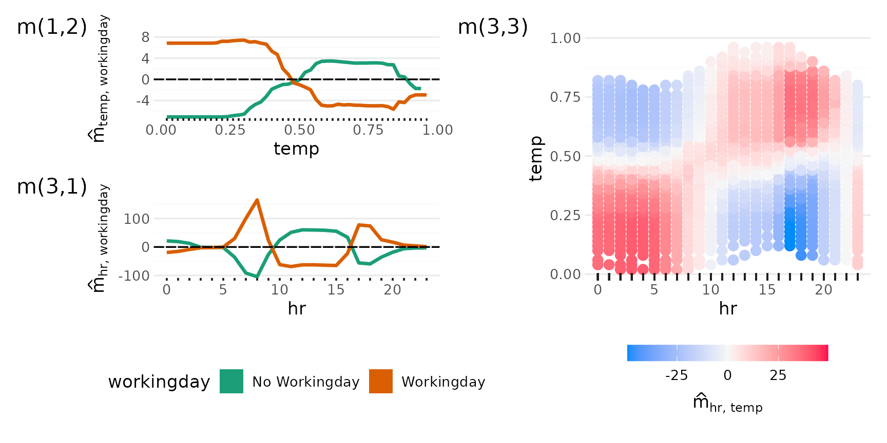

## 3-Way Interaction

``` r
p_3way <- plot_threeway_effects(components, c("hr", "temp", "workingday"))

p_3way
```

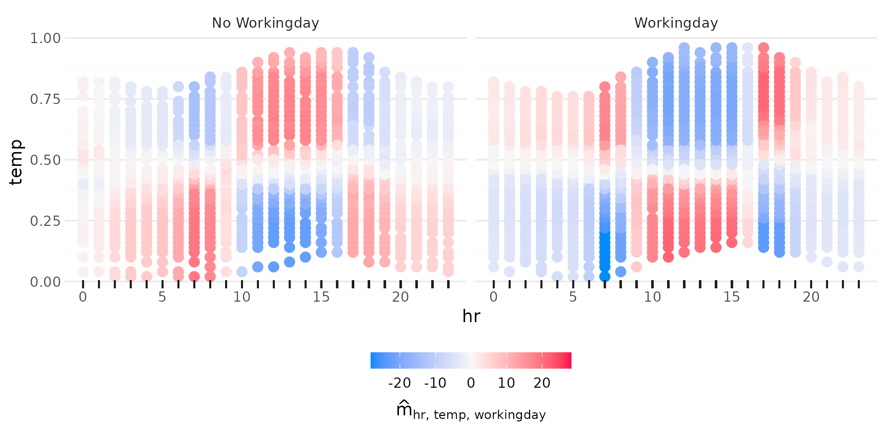

## Everything Together

``` r
p_main / p_2way / p_3way + 
  plot_layout(heights = c(.2, .5, .3))
```

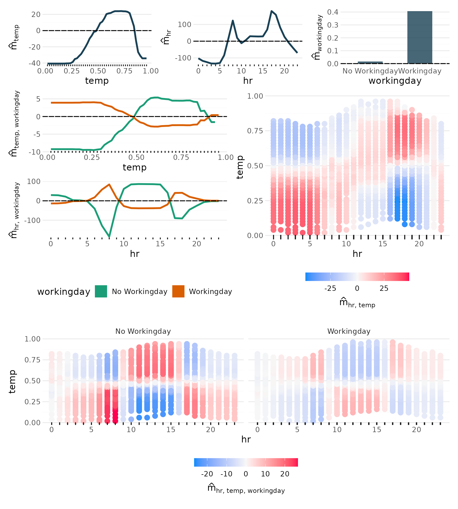

## Additional effects

All main effects:

Iterating over `vars` (hr, temp, workingday, hum, weathersit, season),
and passing each to `plot_main_effect`, then collecting the plots with
[`patchwork::wrap_plots()`](https://patchwork.data-imaginist.com/reference/wrap_plots.html):

``` r
wrap_plots(lapply(vars, plot_main_effect, object = components))
```

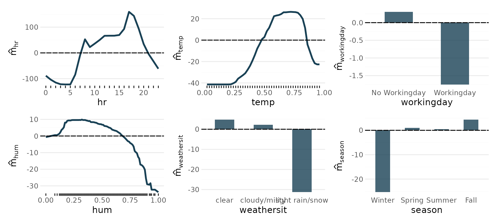

From here we use `autoplot` for convenience. Internally it just passes
its arguments on to the specialized `plot_*` functions, depending on the
number of predictors supplied.

``` r
autoplot(components, c("season", "workingday"))
```

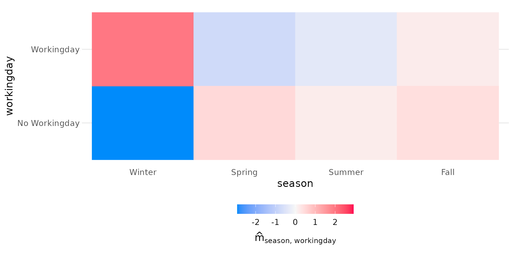

``` r
autoplot(components, c("season", "hr"))
```

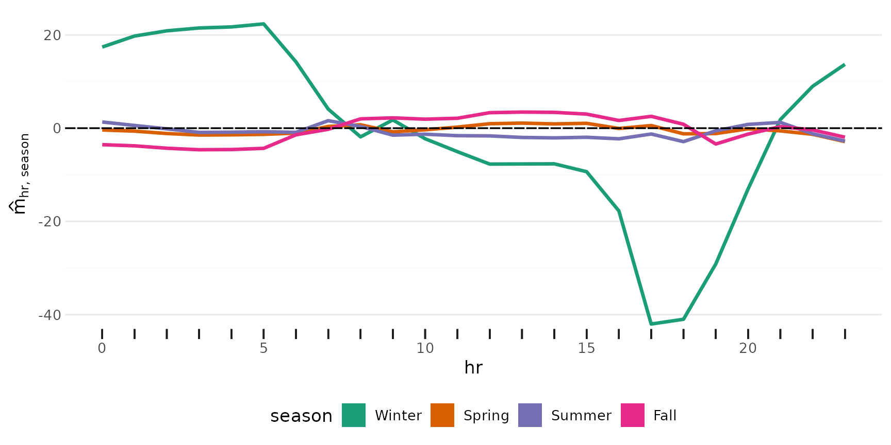

``` r
autoplot(components, c("season", "weathersit"))
```

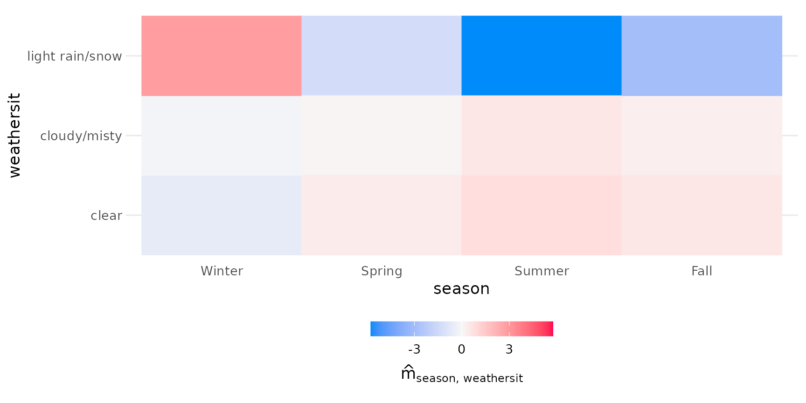

``` r
autoplot(components, c("weathersit", "temp"))
```

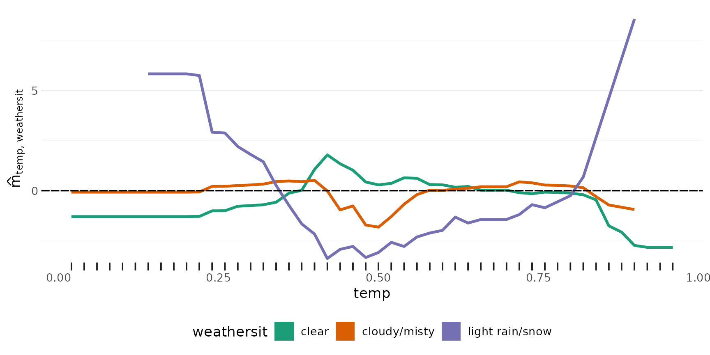

``` r
autoplot(components, c("hum", "temp"))
```

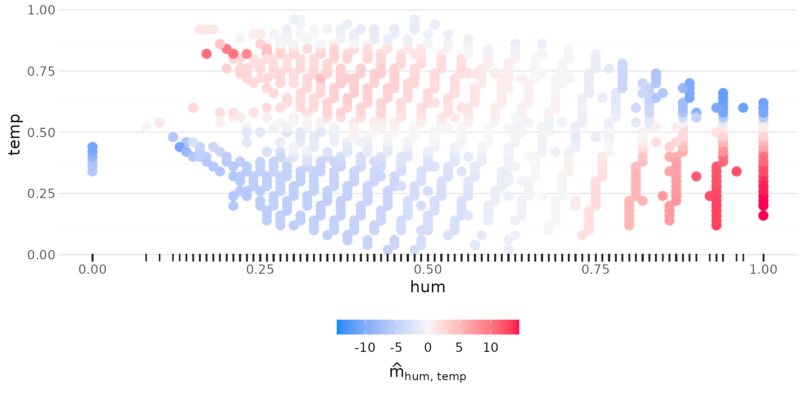

3rd degree interactions can be tricky, if they have any effect at all.

``` r
autoplot(components, c("season", "hr", "weathersit"))
```

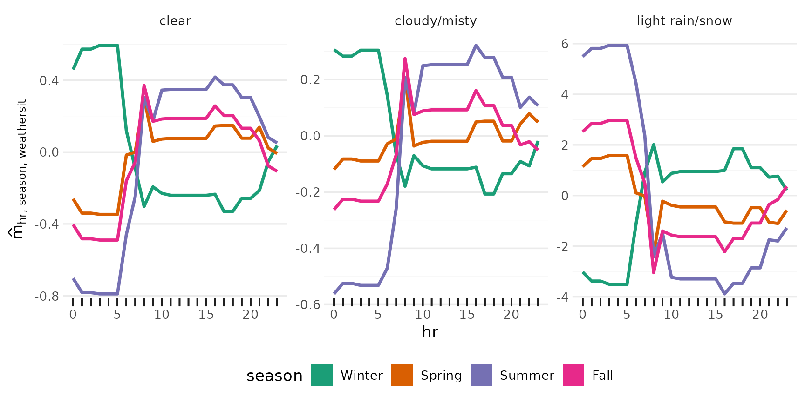

``` r
autoplot(components, c("workingday", "hr", "season"))
```

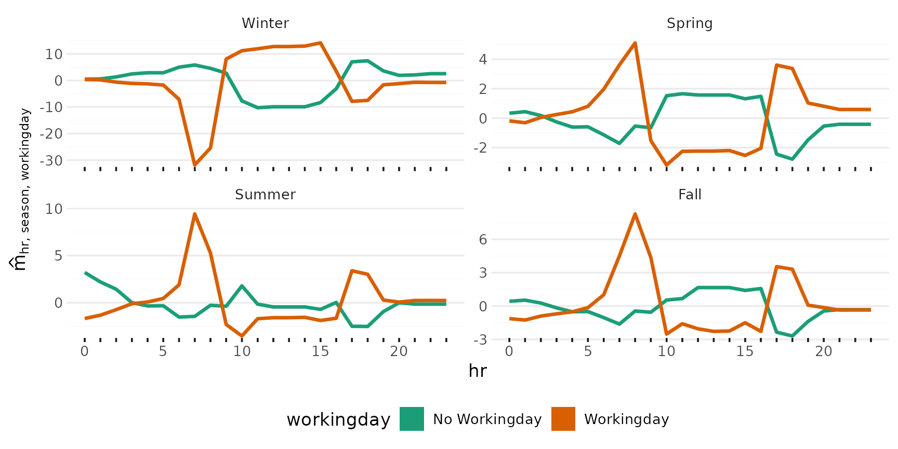

``` r
# Hard to interpret
autoplot(components, c("workingday", "hr", "weathersit"))
```

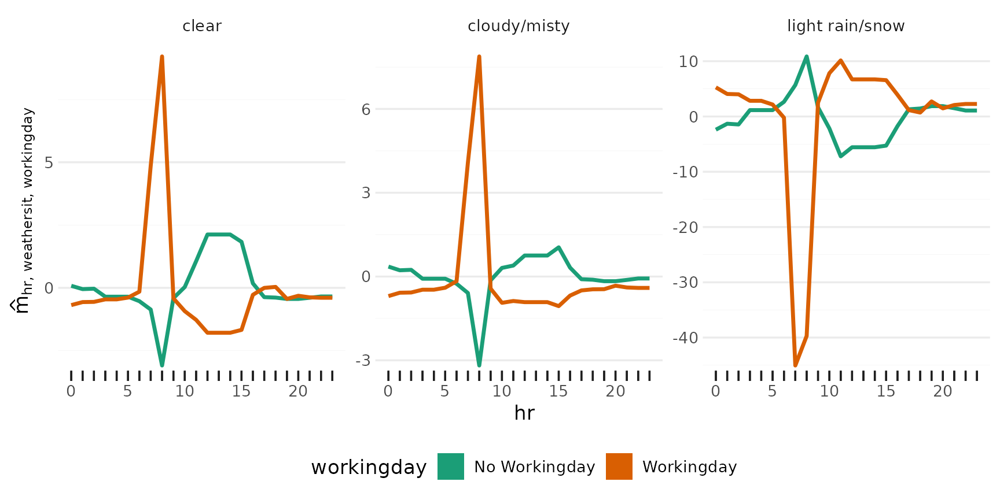

``` r
# zero effect
autoplot(components, c("weathersit", "season", "workingday"))
```

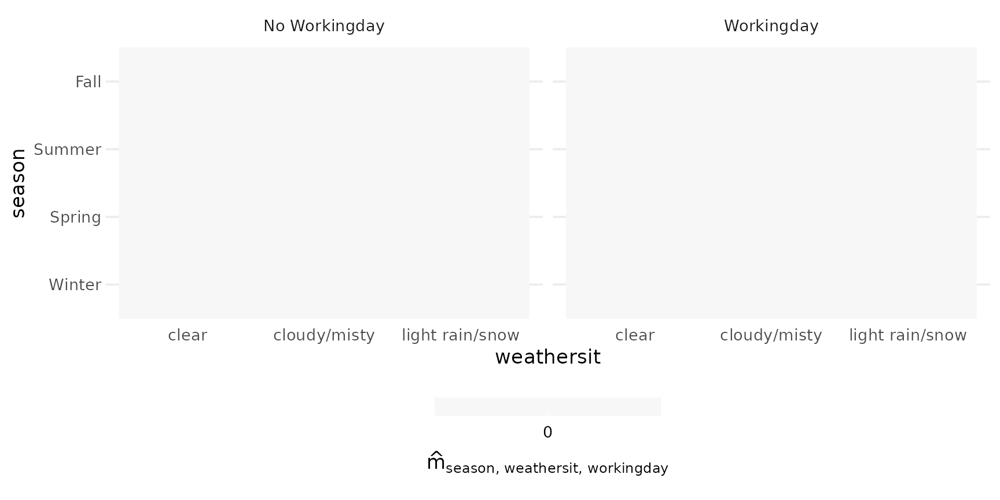
