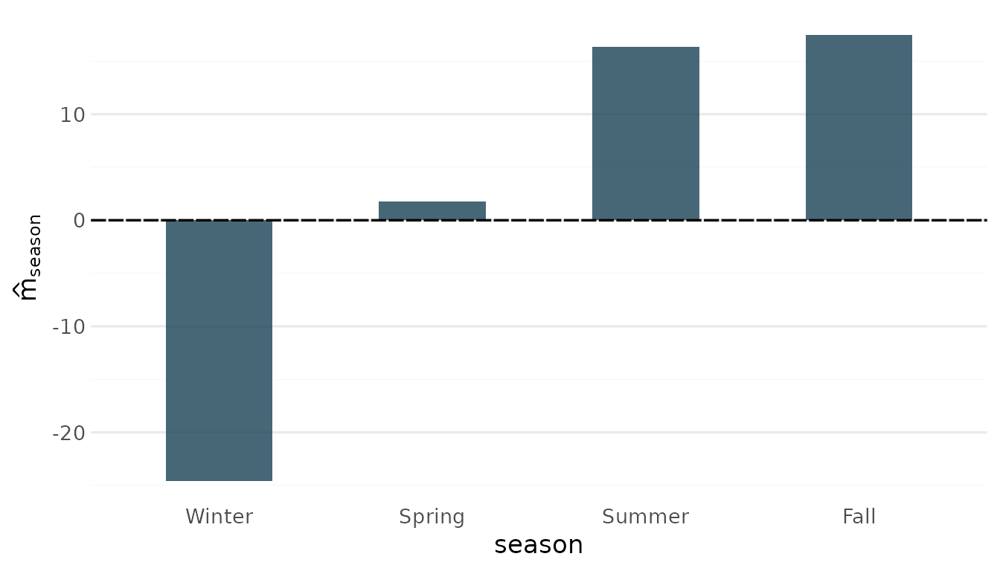
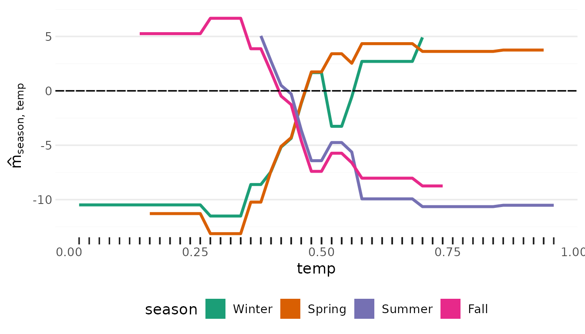
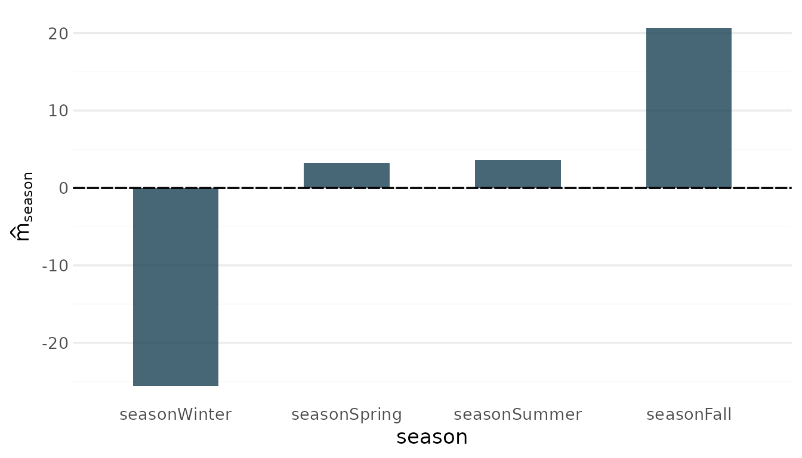
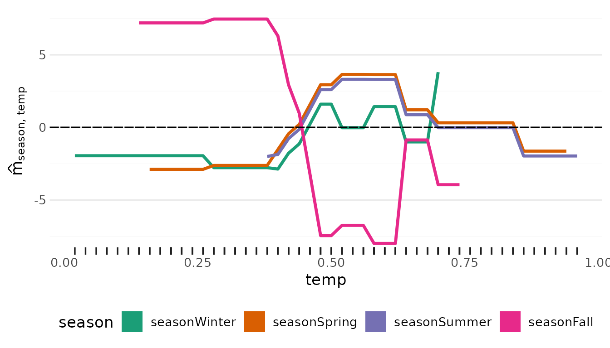
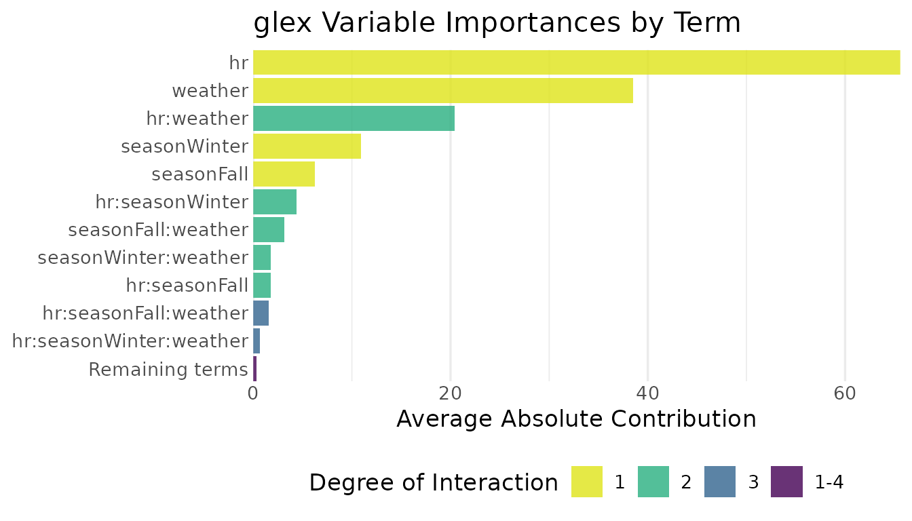

# Categorical features: native factors, one-hot groups and semantic groups

``` r

library(glex)
library(xgboost)
set.seed(1)
```

A categorical predictor can reach `xgboost` in two ways, and `glex`
handles both:

1.  **Native factors** (`xgboost >= 3.0`): fit on a `data.frame` with
    factor columns. The trees split on sets of levels, and the
    decomposition treats the factor as one feature from the start.
2.  **Dummy encoding** via
    [`model.matrix()`](https://rdrr.io/r/stats/model.matrix.html): the
    classic route, and the only one for models fit before native
    support. The decomposition then sees one feature per level, and
    [`group_components()`](https://plantedml.com/glex/reference/group_components.md)
    re-assembles the factor afterwards.

[`group_components()`](https://plantedml.com/glex/reference/group_components.md)
also serves a third purpose: treating any set of features as one, e.g. a
block of related measurements.

The built-in `bike` data has a four-level `season` factor alongside
numeric predictors:

``` r

data(bike, package = "glex")
x_df <- as.data.frame(bike[, c("season", "hr", "temp", "hum")])
str(x_df)
#> 'data.frame':    8645 obs. of  4 variables:
#>  $ season: Factor w/ 4 levels "Winter","Spring",..: 1 1 1 1 1 1 1 1 1 1 ...
#>  $ hr    : num  0 1 2 3 4 5 6 7 8 9 ...
#>  $ temp  : num  0.24 0.22 0.22 0.24 0.24 0.24 0.22 0.2 0.24 0.32 ...
#>  $ hum   : num  0.81 0.8 0.8 0.75 0.75 0.75 0.8 0.86 0.75 0.76 ...
```

## Native factors

With a `data.frame` input,
[`xgboost()`](https://rdrr.io/pkg/xgboost/man/xgboost.html) treats
factor columns as categorical. Pass the same `data.frame` to
[`glex()`](https://plantedml.com/glex/reference/glex.md); the factor
levels must match the training data in order, as for
[`predict()`](https://rdrr.io/r/stats/predict.html).

``` r

xg_native <- xgboost(
  x_df,
  bike$bikers,
  nrounds = 50,
  max_depth = 3,
  learning_rate = 0.1,
  nthreads = 2
)
res_native <- glex(xg_native, x_df)
names(res_native$m)
#>  [1] "season"             "hr:season"          "hr:season:temp"    
#>  [4] "season:temp"        "hr"                 "hr:temp"           
#>  [7] "temp"               "hr:hum:season:temp" "hr:hum:season"     
#> [10] "hum:season:temp"    "hum:season"         "hr:hum:temp"       
#> [13] "hr:hum"             "hum:temp"           "hum"
```

`season` is one feature: there is a single main effect and single
interactions with the numeric predictors. The factor column is kept in
`$x`, so plots treat it as categorical:

``` r

plot_main_effect(res_native, "season")
```



``` r

plot_twoway_effects(res_native, c("season", "temp"))
```



## Dummy encoding fragments the decomposition

Encoding `season` with
[`model.matrix()`](https://rdrr.io/r/stats/model.matrix.html) gives one
column per level. The decomposition then treats every dummy column as a
feature of its own: the effect of the factor is smeared across its
dummies *and* their mutual “interactions”, which are artifacts of the
encoding rather than anything about the data.

``` r

x <- cbind(
  model.matrix(~ season - 1, bike),
  as.matrix(bike[, c("hr", "temp", "hum")])
)
colnames(x)
#> [1] "seasonWinter" "seasonSpring" "seasonSummer" "seasonFall"   "hr"          
#> [6] "temp"         "hum"

xg <- xgb.train(
  params = xgb.params(max_depth = 3, learning_rate = 0.1, nthread = 2),
  data = xgb.DMatrix(x, label = bike$bikers, nthread = 2),
  nrounds = 50
)
res <- glex(xg, x)
ncol(res$m)
#> [1] 47
```

Among these terms are things like `seasonFall:seasonWinter`, an
“interaction” between two levels of the same factor:

``` r

head(sort(colMeans(abs(as.matrix(res$m))), decreasing = TRUE), 10)
#>              hr            temp         hr:temp             hum    seasonWinter 
#>       65.597247       35.139222       16.901747       14.016117       10.907372 
#>          hr:hum      seasonFall hr:seasonWinter        hum:temp seasonFall:temp 
#>        8.785011        6.212056        4.371334        3.667917        2.827076
```

### Re-assembling the factor with `group_components()`

[`group_components()`](https://plantedml.com/glex/reference/group_components.md)
aggregates all terms feature-wise: terms involving only `season` dummies
become the `season` main effect, terms mixing a dummy with `hr` become
the `season:hr` interaction, and so on. Because the decomposition is
additive, this is exact.

[`dummy_groups()`](https://plantedml.com/glex/reference/dummy_groups.md)
builds the required `groups` list from the *un-encoded* data, matching
the [`model.matrix()`](https://rdrr.io/r/stats/model.matrix.html) naming
convention by default. `bike` carries further factors (`mnth`,
`workingday`, `weathersit`) that we did not encode into `x`;
[`dummy_groups()`](https://plantedml.com/glex/reference/dummy_groups.md)
reports them and moves on:

``` r

dummy_groups(res, bike)
#> No encoded columns found for: mnth, workingday, weathersit. If these were encoded, pass a `naming` function matching the column names in `object$x`.
#> $season
#> [1] "seasonWinter" "seasonSpring" "seasonSummer" "seasonFall"
grouped <- group_components(res, dummy_groups(res, bike))
#> No encoded columns found for: mnth, workingday, weathersit. If these were encoded, pass a `naming` function matching the column names in `object$x`.
names(grouped$m)
#>  [1] "season"             "hr:season"          "hr:season:temp"    
#>  [4] "season:temp"        "hr"                 "hr:temp"           
#>  [7] "temp"               "hr:hum:season:temp" "hr:hum:season"     
#> [10] "hum:season:temp"    "hum:season"         "hr:hum:temp"       
#> [13] "hr:hum"             "hum:temp"           "hum"
```

The components still sum to the model prediction, and the SHAP value of
`season` is the sum of its dummies’ SHAP values, so the efficiency
property is preserved:

``` r

all.equal(rowSums(grouped$m), rowSums(res$m))
#> [1] TRUE
all.equal(
  grouped$shap$season,
  rowSums(as.matrix(res$shap[, startsWith(names(res$shap), "season"), with = FALSE]))
)
#> [1] TRUE
```

Since the grouped columns of `x` form a one-hot encoding,
[`group_components()`](https://plantedml.com/glex/reference/group_components.md)
reconstructs the factor, and the plot functions work as for the native
model:

``` r

plot_main_effect(grouped, "season")
```



``` r

plot_twoway_effects(grouped, c("season", "temp"))
```



Both routes end with `season` as one feature, but they explain different
models: native categorical splits partition the levels freely, while a
dummy split isolates one level at a time. Grouping is an exact
regrouping of the dummy model’s decomposition, not an approximation of
the native one.

### Other encoding schemes

If the dummy columns are not named in
[`model.matrix()`](https://rdrr.io/r/stats/model.matrix.html) style,
pass a `naming` function of `(feature, levels)` that reproduces the
column names the model was trained with:

``` r

dummy_groups(
  res,
  bike,
  naming = function(feature, levels) paste(feature, levels, sep = "_")
)
```

[`dummy_groups()`](https://plantedml.com/glex/reference/dummy_groups.md)
only returns columns that actually exist in `object$x`, so a dropped
reference level (treatment coding via `~ season`) is skipped
automatically; the reconstructed factor then shows a `"(base)"` level
for observations of the reference category.

## Semantic groups

Grouping is not limited to dummy encodings. Any set of features can be
treated as one, for example a “weather” block, which in
higher-dimensional settings might be a group of anthropometrics,
demographics or biomarkers:

``` r

weather <- group_components(res, groups = list(weather = c("temp", "hum")))
head(sort(colMeans(abs(as.matrix(weather$m))), decreasing = TRUE), 10)
#>                    hr               weather            hr:weather 
#>             65.597247             38.517036             20.414133 
#>          seasonWinter            seasonFall       hr:seasonWinter 
#>             10.907372              6.212056              4.371334 
#>    seasonFall:weather  seasonWinter:weather         hr:seasonFall 
#>              3.144545              1.799806              1.747389 
#> hr:seasonFall:weather 
#>              1.536791
```

For such groups no single x value exists, so `weather$x$weather` is `NA`
and the effect plots are not available for that group, but term
importances and SHAP values aggregate as usual:

``` r

library(ggplot2)
autoplot(glex_vi(weather), threshold = 0.5)
```


